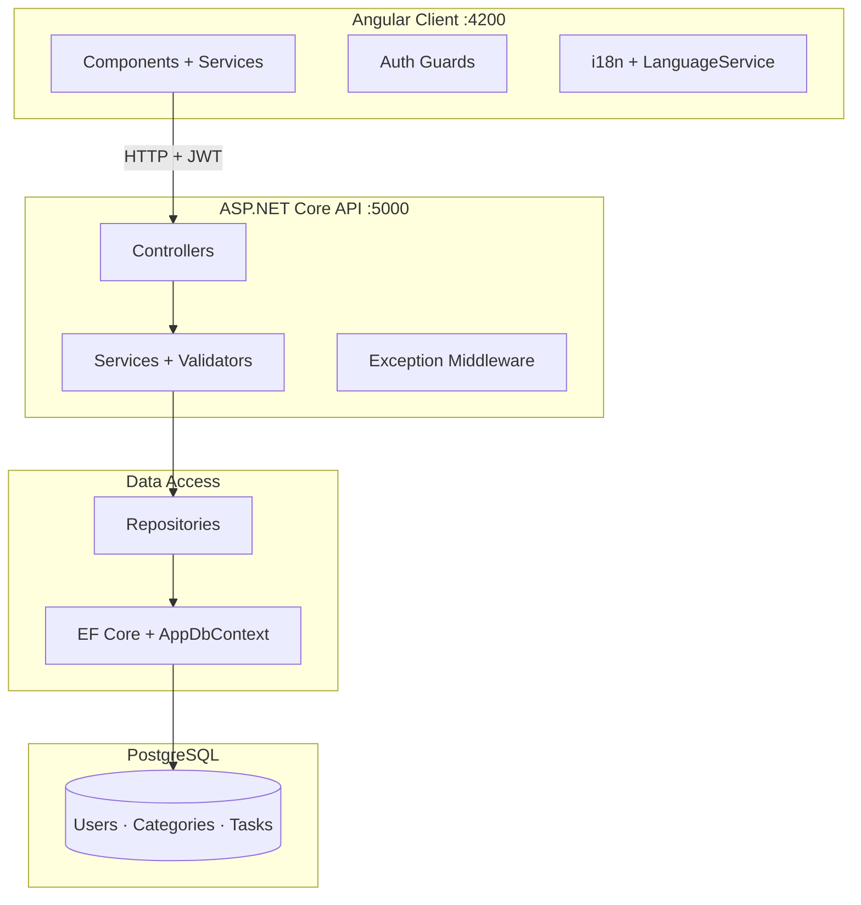
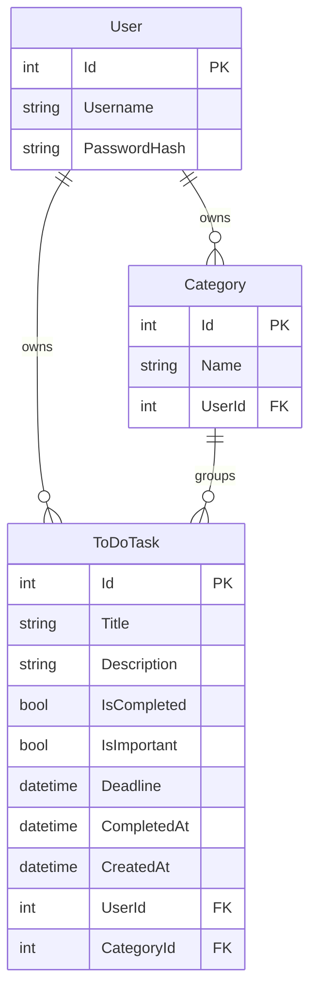
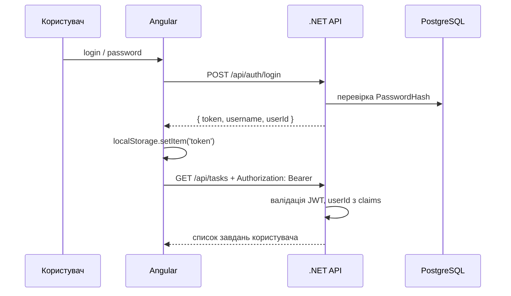

# TODO App — веб-додаток для управління завданнями

Full-stack застосунок у стилі Microsoft To Do: реєстрація, JWT-авторизація, категорії, завдання з дедлайнами, вкладки списків, пошук і двомовний інтерфейс (UK/EN).

> **Гілка з повною реалізацією:** `feature/task-lists-search-i18n`  
> **Стек:** ASP.NET Core 8 · Angular 19 · PostgreSQL · Entity Framework Core

---

## Зміст

1. [Мета проєкту](#мета-проєкту)
2. [Архітектура](#архітектура)
3. [Структура рішення](#структура-рішення)
4. [Модель даних](#модель-даних)
5. [Як працює API](#як-працює-api)
6. [Бізнес-логіка вкладок](#бізнес-логіка-вкладок)
7. [Пошук і фільтри](#пошук-і-фільтри)
8. [Frontend (Angular)](#frontend-angular)
9. [Авторизація JWT](#авторизація-jwt)
10. [Скріншоти для доповіді](#скріншоти-для-доповіді)
11. [Запуск проєкту](#запуск-проєкту)
12. [Тестування](#тестування)
13. [Шпаргалка для захисту](#шпаргалка-для-захисту)

---

## Мета проєкту

Створити персональний todo-додаток, де кожен користувач:

- реєструється та входить через JWT;
- створює **категорії** (Дім, Робота, Продукти…);
- додає **завдання** з описом, дедлайном, позначкою «важливо»;
- переглядає завдання у **розумних списках** (Мій день, Заплановано, Виконано…);
- **шукає** за текстом і **фільтрує** за категорією та діапазоном дат;
- перемикає **мову інтерфейсу** (українська / англійська).

---

## Архітектура

Застосунок побудований за **шаровою (layered) архітектурою** — кожен шар має одну відповідальність.



### Потік запиту (приклад: завантаження завдань)

1. Користувач відкриває вкладку **«Мій день»** → Angular викликає `TaskService.getTasks(..., listType: 'myday')`.
2. HTTP GET `/api/tasks?listType=myday&pageNumber=1&pageSize=10` з заголовком `Authorization: Bearer <token>`.
3. `TasksController` отримує `userId` з JWT і викликає `TaskService`.
4. `TaskService` делегує в `TaskRepository`, де формується LINQ-запит до PostgreSQL.
5. Результат повертається як `PagedResult<TaskDto>` у JSON (camelCase).

---

## Структура рішення

| Проєкт | Призначення |
|--------|-------------|
| `TODO-App.Api` | HTTP API, JWT, Swagger, CORS, middleware |
| `TODO-App.Services` | Бізнес-логіка, DTO, FluentValidation |
| `TODO-App.DataAccess` | EF Core, репозиторії, міграції |
| `TODO-App.Domain` | Сутності, інтерфейси репозиторіїв |
| `TODO-App.Client` | Angular SPA (компоненти, сервіси, i18n) |
| `TODO-App.Tests` | Unit- та integration-тести (xUnit) |

---

## Модель даних



### Ключові поля завдання

| Поле | Навіщо |
|------|--------|
| `Deadline` | Дедлайн — для вкладок «Мій день», «Заплановано», фільтра дат |
| `IsImportant` | Зірочка — вкладка «Важливо» |
| `IsCompleted` / `CompletedAt` | Статус виконання — вкладка «Виконано» |
| `CreatedAt` | Дата створення — «Мій день» для завдань без дедлайну |
| `CategoryId` | Зв'язок із категорією користувача |

---

## Як працює API

### Auth

| Метод | URL | Опис |
|-------|-----|------|
| POST | `/api/auth/register` | Реєстрація → JWT |
| POST | `/api/auth/login` | Вхід → JWT |
| POST | `/api/auth/logout` | Logout (клієнт видаляє токен) |

### Categories (потрібен JWT)

| Метод | URL | Опис |
|-------|-----|------|
| GET | `/api/categories` | Список категорій поточного користувача |
| POST | `/api/categories` | Створити категорію |
| PUT | `/api/categories/{id}` | Оновити |
| DELETE | `/api/categories/{id}` | Видалити |

### Tasks (потрібен JWT)

| Метод | URL | Опис |
|-------|-----|------|
| GET | `/api/tasks` | Список з пагінацією, фільтрами, `listType` |
| GET | `/api/tasks/{id}` | Одне завдання |
| POST | `/api/tasks` | Створити |
| PUT | `/api/tasks/{id}` | Оновити |
| DELETE | `/api/tasks/{id}` | Видалити |

### Query-параметри GET `/api/tasks`

| Параметр | Приклад | Опис |
|----------|---------|------|
| `pageNumber` | `1` | Номер сторінки |
| `pageSize` | `10` | Розмір сторінки |
| `categoryId` | `2` | Фільтр за категорією |
| `search` | `молоко` | Пошук у назві/описі (без урахування регістру) |
| `listType` | `myday` | Тип списку (див. нижче) |
| `dateFrom` | `2026-06-15` | Дедлайн від (формат `yyyy-MM-dd`) |
| `dateTo` | `2026-06-20` | Дедлайн до (включно) |

---

## Бізнес-логіка вкладок

Логіка реалізована в `TaskRepository` — **на бекенді**, щоб фронтенд лише передавав `listType`.

| Вкладка | `listType` | Умова |
|---------|------------|-------|
| **Мій день** | `myday` | Невиконані + (прострочені **або** дедлайн сьогодні **або** створені сьогодні без дедлайну) |
| **Важливо** | `important` | `IsImportant = true` і не виконані |
| **Заплановано** | `planned` | Є дедлайн, не виконані, дедлайн ≥ сьогодні |
| **Виконано** | `completed` | `IsCompleted = true` |
| **Призначено мені** | `assignedtome` | Усі невиконані |
| **Завдання** | `tasks` | Усі завдання без обмеження за статусом |

### «Мій день» — три групи завдань

```
1. Прострочені:     Deadline < сьогодні, IsCompleted = false
2. На сьогодні:     Deadline у межах сьогоднішнього дня
3. Без дедлайну:    CreatedAt сьогодні, Deadline = null
```

**Сортування:** спочатку прострочені → потім за дедлайном.

### «Заплановано» — календарний огляд

```
Deadline != null
IsCompleted = false
Deadline >= початок сьогоднішнього дня
```

**Сортування:** `OrderBy(Deadline)` — найближчі зверху.

> Прострочені завдання потрапляють у **«Мій день»**, а не у **«Заплановано»** — це навмисне розділення «боргу» і «календаря».

---

## Пошук і фільтри

### Текстовий пошук

- Регістронезалежний (`ToLower().Contains()`).
- На фронтенді — **миттєвий** (debounce 250 ms), без кнопки «Застосувати».
- При помилці API список **очищується**, щоб не показувати застарілі дані.

### Фільтр за датами

- Фільтрує за полем **Deadline**.
- Дати передаються як рядки `yyyy-MM-dd` і парсяться через `TaskQueryDateParser`.
- Якщо `dateFrom > dateTo` — дати автоматично міняються місцями.

### Прострочені дедлайни (UI)

- Невиконані завдання з `Deadline < now` підкреслюються **червоним** (`task-overdue` CSS-клас).

---

## Frontend (Angular)

### Маршрути

| URL | Компонент | Доступ |
|-----|-----------|--------|
| `/login` | LoginComponent | тільки гості |
| `/register` | RegisterComponent | тільки гості |
| `/tasks` | TasksComponent | авторизовані |
| `/categories` | CategoriesComponent | авторизовані |
| `/settings` | SettingsComponent | авторизовані |

### Guards

- `authGuard` — не пускає без JWT.
- `guestGuard` — не пускає авторизованих на login/register.

### i18n

- Файл перекладів: `TODO-App.Client/src/app/i18n/translations.ts`
- `LanguageService` зберігає мову в `localStorage`
- Pipe `| t` для шаблонів
- Перемикач мови: `LanguageSwitcherComponent` + сторінка Settings

### Ключові сервіси

| Сервіс | Роль |
|--------|------|
| `AuthService` | login/register, збереження JWT |
| `TaskService` | CRUD завдань, query-параметри |
| `CategoryService` | CRUD категорій |
| `LanguageService` | поточна мова, translate() |

---

## Авторизація JWT



- Паролі зберігаються як **хеш** (не plain text).
- Кожен запит до tasks/categories ізолює дані за `UserId`.
- JWT — **stateless**: сервер не зберігає сесії; logout = видалення токена на клієнті.

---

## Скріншоти для доповіді

Створіть папку `docs/screenshots/` і додайте зображення. У README залишені placeholder-и — замініть шляхи після вставки.

### 1. Вхід / реєстрація


> 📸 *Скріншот: `/login` — форма входу з локалізованими підписами.*


> 📸 *Скріншот: `/register` — створення нового акаунта.*

---

### 2. Головна — вкладки завдань


> 📸 *Скріншот: вкладки «Мій день», «Важливо», «Заплановано», «Виконано»…*


> 📸 *Скріншот: «Мій день» — прострочені + сьогоднішні завдання.*


> 📸 *Скріншот: «Заплановано» — майбутні завдання, відсортовані за дедлайном.*

---

### 3. Пошук і фільтри


> 📸 *Скріншот: миттєвий пошук під час введення тексту.*


> 📸 *Скріншот: поля «Дата від» / «Дата до» + результат фільтрації.*


> 📸 *Скріншот: червоне підкреслення прострочених дедлайнів.*

---

### 4. Категорії та налаштування


> 📸 *Скріншот: сторінка `/categories`.*


> 📸 *Скріншот: `/settings` — перемикач UK/EN.*

---

### 5. Backend


> 📸 *Скріншот: Swagger UI `http://localhost:5000/swagger`.*


> 📸 *Скріншот: pgAdmin / таблиці Users, Categories, Tasks.*

---

## Запуск проєкту

### Вимоги

- .NET 8 SDK
- Node.js 18+
- PostgreSQL 15+
- Angular CLI (`npm install -g @angular/cli`)

### 1. База даних

Налаштуйте `TODO-App.Api/appsettings.Development.json`:

```json
"ConnectionStrings": {
  "DefaultConnection": "Host=localhost;Port=5432;Database=TodoDb;Username=postgres;Password=YOUR_PASSWORD"
}
```

Застосуйте міграції:

```powershell
dotnet ef database update `
  --project TODO-App.DataAccess `
  --startup-project TODO-App.Api
```

### 2. Backend

```powershell
cd D:\RiderProjects\TODO-App
dotnet run --project TODO-App.Api
```

API: `http://localhost:5000`  
Swagger: `http://localhost:5000/swagger`

### 3. Frontend

```powershell
cd TODO-App.Client
npm install
npm start
```

UI: `http://localhost:4200`

---

## Тестування

```powershell
dotnet test TODO-App.Tests
```

Покриття включає:

- CRUD завдань, пагінацію, пошук;
- фільтри `listType` (My Day, Planned, Important…);
- фільтр діапазону дат;
- валідацію формату дати (400 Bad Request);
- unit-тести сервісного шару та парсера дат.

---

## Шпаргалка для захисту

Короткий сценарій доповіді (5–7 хв):

### 1. Вступ (30 сек)

> «Я розробив full-stack TODO-додаток на .NET 8 і Angular 19 з PostgreSQL. Кожен користувач має власні категорії та завдання, захищені JWT-авторизацією.»

### 2. Архітектура (1 хв)

> «Проєкт розділений на шари: API → Services → Repositories → EF Core → PostgreSQL. Angular SPA спілкується з API через REST. Такий поділ полегшує тестування і підтримку коду.»

*Показати diagram з README.*

### 3. Авторизація (1 хв)

> «При логіні сервер перевіряє хеш пароля і видає JWT. Токен зберігається в localStorage і передається в заголовку Authorization. Guards на Angular не пускають на `/tasks` без токена.»

*Показати скрін login + Swagger з Bearer.*

### 4. Завдання і вкладки (2 хв)

> «Головна фішка — розумні списки. „Мій день" показує прострочені, сьогоднішні та щойно створені завдання. „Заплановано" — майбутні з дедлайном, відсортовані за датою. Логіка на бекенді в TaskRepository через параметр listType.»

*Показати скрін My Day і Planned.*

### 5. Пошук і фільтри (1 хв)

> «Пошук миттєвий, регістронезалежний. Є фільтр за діапазоном дат дедлайну. Прострочені підсвічуються червоним.»

*Показати скрін search + overdue.*

### 6. i18n і тести (30 сек)

> «Інтерфейс двомовний — UK/EN через власний LanguageService. Є 20 автотестів на xUnit.»

*Показати settings + `dotnet test`.*

### 7. Висновок (30 сек)

> «Проєкт демонструє REST API, роботу з БД, авторизацію, бізнес-логіку фільтрації та сучасний SPA-інтерфейс.»

---

## Корисні файли для заглиблення

| Файл | Що там |
|------|--------|
| `TODO-App.DataAccess/Repositories/TaskRepository.cs` | Фільтри вкладок, пошук, дати, сортування |
| `TODO-App.Api/Controllers/TasksController.cs` | HTTP-ендпоінти, парсинг дат |
| `TODO-App.Services/Helpers/TaskQueryDateParser.cs` | Безпечний парсинг `yyyy-MM-dd` |
| `TODO-App.Client/src/app/components/tasks/tasks.component.ts` | UI вкладок, debounce-пошук |
| `TODO-App.Client/src/app/i18n/translations.ts` | Переклади UK/EN |
| `TODO-App.Tests/Integration/TasksApiTests.cs` | Integration-тести API |

---

## Автор

**Ваше ім'я / група** — курс, рік.

---

*Оновлено для гілки `feature/task-lists-search-i18n`.*
